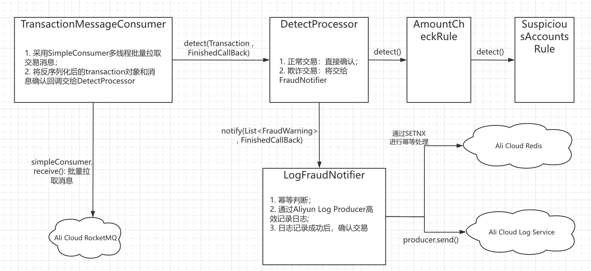
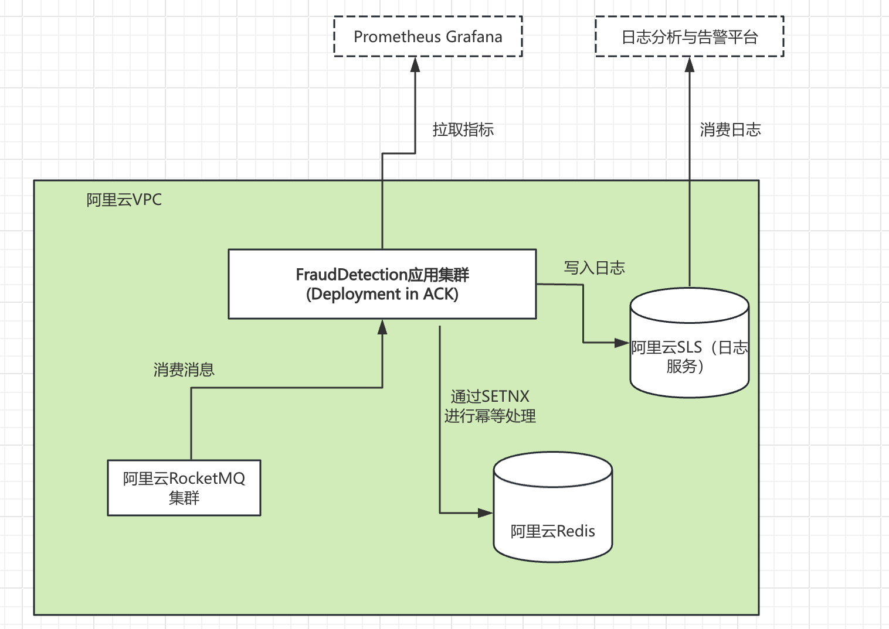
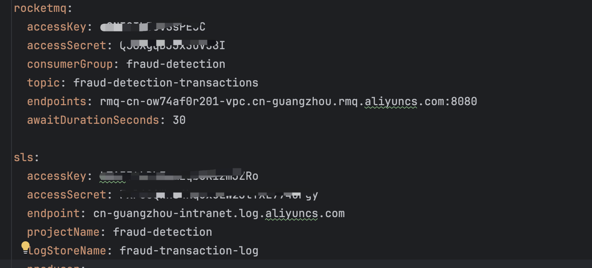
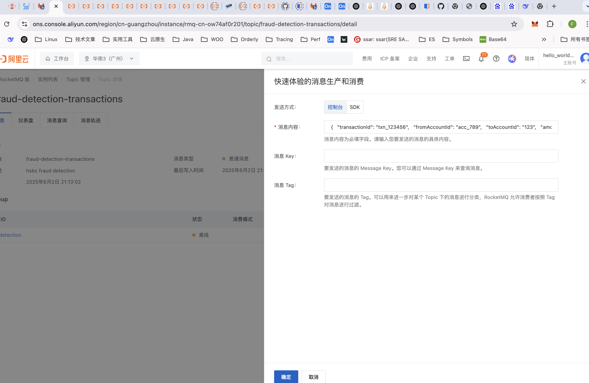
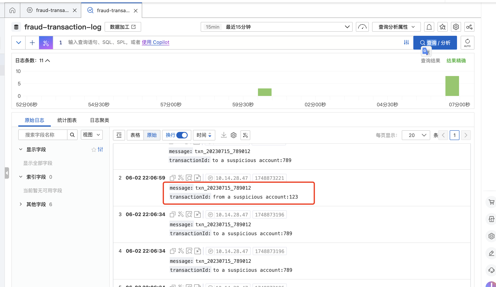

# 实时欺诈监测系统架构设计
## 设计目标
    快速（swiftly）准确（accurately）地识别出欺诈交易，以减少损失；
## 设计挑战与应对
1. 通过MQ技术接收交易数据时，如何解决消息重复消费，消息丢失和消息积压的问题？
    - 消息重复消费：在系统网络异常，Broker主从切换，Rebalance等场景下，会发生消息重复消费。通常的方案时通过幂等操作来消除消息重复消费的影响。但对于当前的场景，分两种情况讨论：
        - 正常交易的重复消费：处理逻辑本身是幂等的，只是多了一次额外的判定，没有负面影响；
        - 欺诈交易的重复消费：如果不进行幂等操作，会存在重复记录日志的副作用。针对这种情况，我们只在Notifier中针对欺诈交易利用Redis缓存进行幂等判断(此处采用弱幂等方案)，从而节省缓存资源，降低总体处理时延；
    - 消息在消费侧丢失：如果在消费侧异步处理消息同时提前确认消息，则会导致消息丢失。为了解决这个问题，采用如下消息确认机制：
        - 正常交易：如果判定一笔交易为正常交易，直接向Broker确认消息；
        - 欺诈交易：如果判定一笔交易为欺诈交易，则不立即确认消息，待成功写入日志后再对其进行确认；
    - 消息积压：如果消费侧处理速度跟不上消息生产速度，则会导致消息堆积。采用如下措施，以避免消息积压：
        - 批量消费：利用RocketMQ 5.x新增的SimpleConsumer的批量消费功能来提高处理效率；写入日志时，采用阿里日志云Producer批量写入的方式来提高写入效率；
        - 并发消费：通过增加Pod数量和线程池的线程数来提高消费并发度
2. 如何确保系统的可演进性？
    - 采用责任链模式来进行欺诈交易监测（detect），以便于后续添加新的监测规则；
## 系统逻辑架构图

## 部署架构图

## 演进规划
当前是本服务的MVP（Minimum Viable Product），后续长期演进的特性规划如下：
1. 因时间关系，幂等和服务健康检查功能尚未实现，待开发；
2. 引入配置中心（比如apollo），可以对当前系统配置进行集中化管理，并对涉密信息进行加密;
3. 提升系统可观测性，如死信队列，采集欺诈交易数量，写入Log Service延迟，线程池Queue堆积，错误日志，消息积压等核心指标，通过Grafana Dashboard进行可视化展示；
# 部署指导
## 前提条件
已在阿里云创建了以下资源：
- ACK集群(https://www.aliyun.com/product/kubernetes?spm=5176.29677750.nav-v2-dropdown-menu-1.d_main_2_0_0.1029154aKMHKhk&scm=20140722.X_data-be21e758d2331715988a._.V_1)
- 云消息队列 RocketMQ 实例（注意：RocketMQ实例要和ACK集群在同一个VPC，并且要将ACK集群的网段加入RocketMQ实例的访问白名单）(https://www.aliyun.com/product/rocketmq?spm=5176.28243677.nav-v2-dropdown-menu-1.d_main_6_1_0.347e31a5mj4K0A&scm=20140722.X_data-d6f01541fc98277954b5._.V_1)
- 阿里云日志服务(https://www.aliyun.com/product/sls?scm=20140722.X_data-1524de0c86e9174771d4._.V_1)
## 部署步骤
1. 根据实际情况修改`application.yml`文件中的以下配置：
   
2. 在本地执行如下命令以打包应用为Docker镜像，并上传到阿里云的镜像仓（相关地址按实际情况进行修改）：
   ```bash
   mvn clean package -Dmaven.test.skip=true
   docker build -t fraud-detection:latest .
   docker tag fraud-detection:latest crpi-d321rolw3i76v3hx.cn-guangzhou.personal.cr.aliyuncs.com/bank_test/fraud-detection:latest
   docker push crpi-d321rolw3i76v3hx.cn-guangzhou.personal.cr.aliyuncs.com/bank_test/fraud-detection:latest
   ```
3. 在ACK集群中执行如下命令: 创建secret以授权后续步骤拉取私有镜像（相关地址和账号信息按实际情况进行修改）：
   ```bash
   kubectl create secret docker-registry aliyun-registry-secret   --docker-server=crpi-d321rolw3i76v3hx.cn-guangzhou.personal.cr.aliyuncs.com  --docker-username=xxx   --docker-password=xxx
   ```
4. 在ACK集群中执行如下命令: 创建deployment
   ```bash
   kubectl apply -f fraud-detection-deployment.yaml
   ```
5. 待deployment创建成功后，服务就部署成功了。
# 测试指导
## 测试步骤
1. 在RocketMQ控制台输入发送如下Json消息以模拟交易（其中123为欺诈账号），具体如下图:
   ``` json
   {
   "transactionId": "txn_123456",
   "fromAccountId": "acc_789",
   "toAccountId": "123",
   "amount": 100.50,
   "timestamp": 1717426800000
   }
   ```
   
2. 在SLS控制台查看日志是否有如下记录（注意：如果没有记录，请检查部署步骤是否正确）：
   